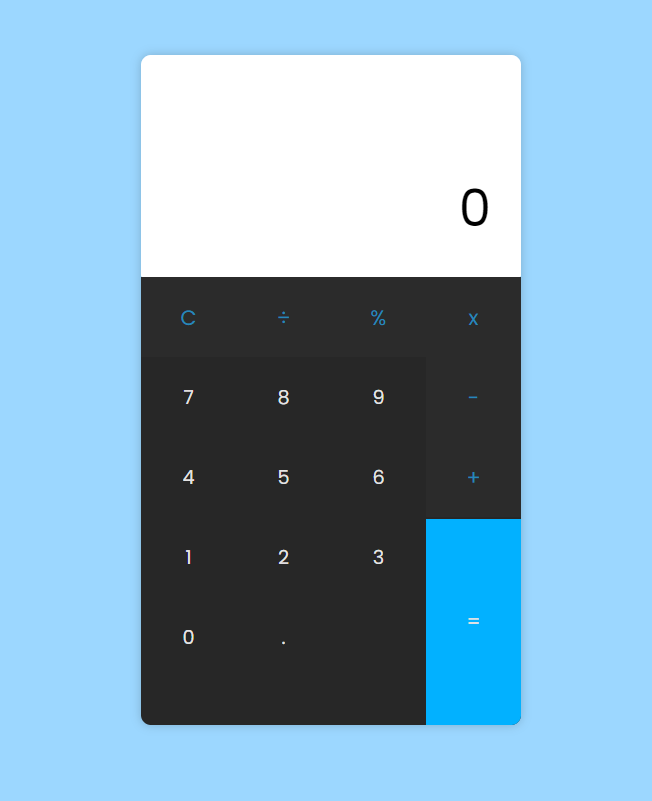

# calculator
A responsive calculator with basic operations as Addition, Subtraction, Multiplication, Division, and Percentages.

## Technologies
In this project I used HTML5, CSS3 and JavaScript

## Result

> ### See and interact with the application [here](https://calculator-lusk1nha.vercel.app/) 

